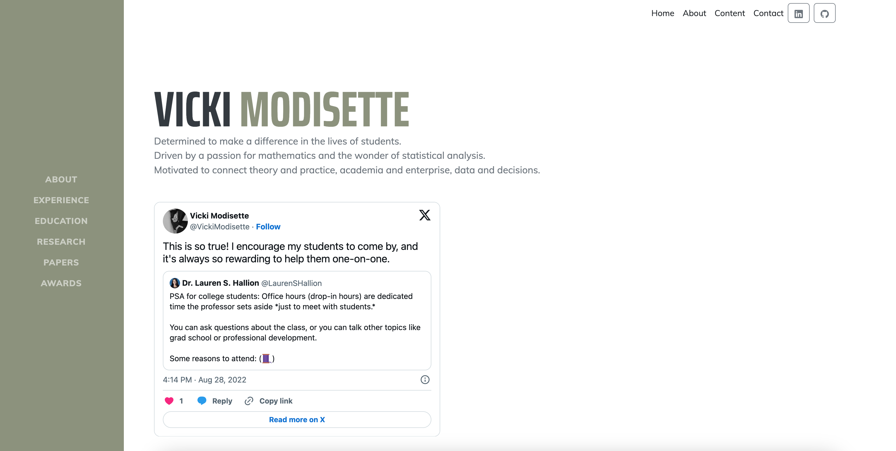
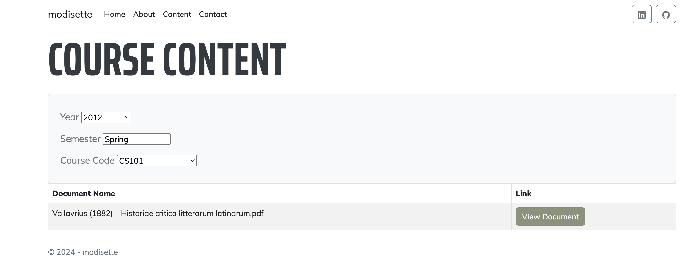
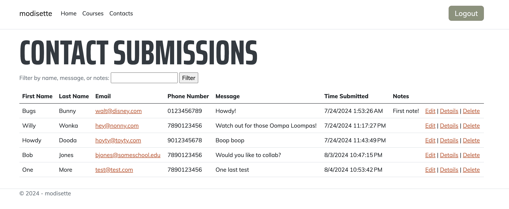
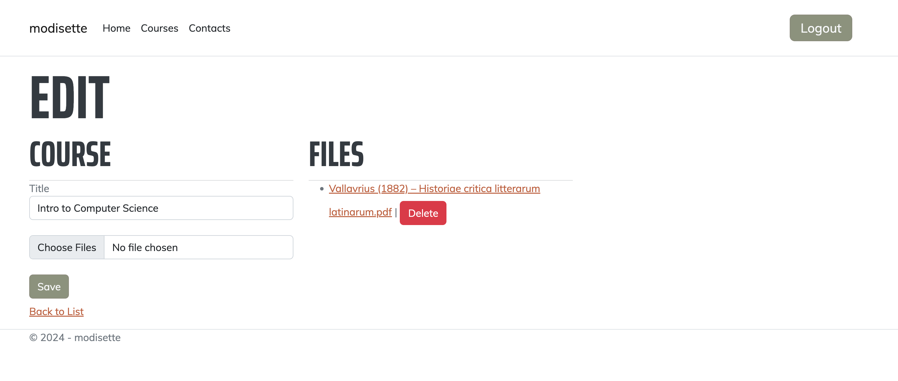

# Modisette.com

## Overview

This capstone project for CODE: You is a personal website for a client, showcasing a blend of modern web technologies and robust backend functionality. Built with ASP.NET Core's Razor Pages, it leverages C#, HTML, CSS, and JavaScript to create a dynamic and responsive user interface. The site features general access to Home, About, Content, and Contact pages, with the About page consuming Twitter's (X's) oEmbed API to integrate her social media feed. Contact form submissions are securely stored in a SQLite database, with notifications sent to the client via Google's SMTP. A hidden admin section allows the client to manage contact submissions and perform CRUD operations on courses and content, with course files stored in the “wwwroot” folder. Authentication and authorization are handled through Auth0, with a custom Node.js script ensuring secure admin access. 

This project demonstrates my ability to develop viable solutions for clients by creating cohesive full-stack applications with secure authentication and authorization flows.

## Table of Contents

- [Demo](#demo)
- [Features](#features)
- [Technologies Used](#technologies-used)
- [Setup Instructions](#setup-instructions)
- [Dependencies](#dependencies)
- [Contact](#contact)

## Demo







## Features

  | Feature        | Description                           |
  |----------------|---------------------------------------|
  | Unit Tests | The project includes 7 unit tests which cover all the basic functions of the site. |
  | Asynchronous Methods | All of the main methods used in the program are asynchronous. |
  | Responsive Design | All pages are built with a responsive design in mind and will work on mobile and desktop devices. |
  | Entity Framework Core | The data layer is abstracted with EF Core as an ORM. There is a one-to-many relationship between courses and course documents, and there is a composite primary key in the courses table. |
  | Complex Queries | The content page has a series of selections which pull data from two related tables in the database. |
  | SOLID Principles | The project follows SOLID design principles where appropriate, as documented in comments within the code base. |

## Technologies Used

- ASP.NET Core (Razor Pages)
- C#
- HTML/CSS
- JavaScript
- Entity Framework Core
- AuthO (OAuth 2.0)
- Google SMTP
- Node.js
- SQLite

## Setup Instructions

1. Clone the repository:
    ```sh
    git clone https://github.com/rmodis1/modisette
    ```
2. Navigate to the project directory:
    ```sh
    cd modisette.com
    ```
3. Install dependencies:
    ```sh
    dotnet restore
    ```
4. Set up the database:
    ```sh
    dotnet ef database update
    ```
5. Run the application:
    ```sh
    dotnet run
    ```

## Dependencies

The project targets .NET 8.0, and that version of .NET will need to be installed for the site to load properly. 

## Contact

For any inquiries, please contact me at [modisetteryan.com](mailto:modisetteryan@gmail.com).
