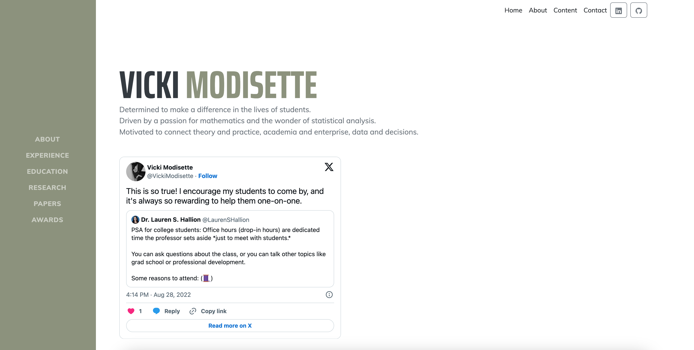
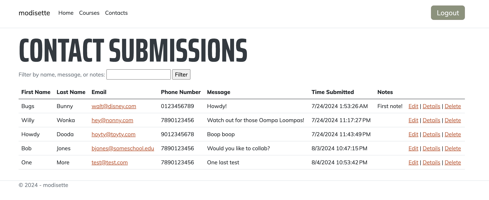
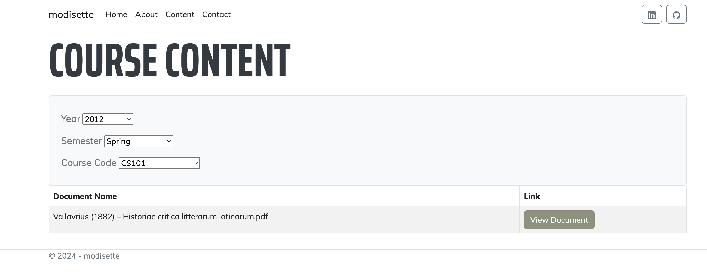

# Modisette.com

## Overview

The project is my capstone project for CODE: You. The application will serve as a personal website for a client. The UI was made using ASP.NET Core's Razor Pages, which allows one to use C# as well as the standard trio of HTML, CSS, and JavaScript on the front end. While most of the front-end functions are written in C#, there are also two brief JavaScript functions for improved UX. The back end was written in C#. The general user has access to the Home, About, Content, and Contact pages. A method on the About page consumes Twitter's (X's) oEmbed API to supply social media feed directly to the page. The information submitted through the contact form on is stored in a SQLite database. There is a hidden admin section where the client can review contact submissions and add/edit/delete (CRUD) courses and related course content. Uploaded files are stored in the wwwroot folder and served up to users through a series of selections on the content page by virtue of their URI. As for contact submissions, beyond the searchable admin dashboard that shows contact submissions, when a contact form is submitted, a version of that message is sent to a dummy email through Google's SMTP. The website uses AuthO (an implementation of OAuth 2.0) to handle authentication and authorization. Within AuthO, I have written a Node.js script that authorizes only certain accounts to access the admin portion of the site.

## Table of Contents

- [Demo](#demo)
- [Features](#features)
- [Technologies Used](#technologies-used)
- [Setup Instructions](#setup-instructions)
- [Dependencies](#dependencies)
- [Contact](#contact)

## Demo






## Features Utilized for the project

  | Feature        | Description                           |
  |----------------|---------------------------------------|
  | Unit Tests | The project includes 7 unit tests which cover all the basic functions of the site. |
  | Asynchronous Methods | All of the main methods used in the program are asynchronous. |
  | Responsive Design | All pages are built with a responsive design in mind and will work on mobile and desktop devices. |
  | Entity Framework Core | The data layer is abstracted with EF Core as an ORM. There is a one-to-many relationship between courses and course documents, and there is a composite primary key in the courses table. |
  | Complex Queries | The content page has a series of selections which pull data from two related tables in the database. |
  | SOLID Principles | The project follows SOLID design principles where appropriate, as documented in comments within the code base. |

## Technologies Used

- ASP.NET Core
- C#
- HTML/CSS
- JavaScript
- Entity Framework Core
- AuthO (OAuth 2.0)
- Google SMTP
- Node.js
- SQLite

## Setup Instructions

1. Clone the repository:
    ```sh
    git clone https://github.com/rmodis1/modisette
    ```
2. Navigate to the project directory:
    ```sh
    cd modisette.com
    ```
3. Install dependencies:
    ```sh
    dotnet restore
    ```
4. Set up the database:
    ```sh
    dotnet ef database update
    ```
5. Run the application:
    ```sh
    dotnet run
    ```

## Dependencies

The project targets .NET 8.0, and that version of .NET will need to be installed for the site to load properly. 

## Contact

For any inquiries, please contact me at [modisetteryan.com](mailto:modisetteryan@gmail.com).
