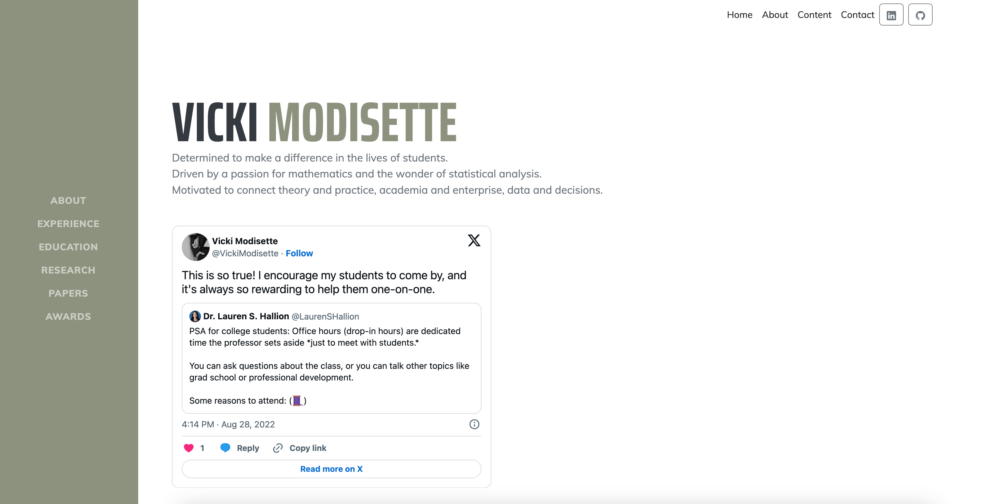
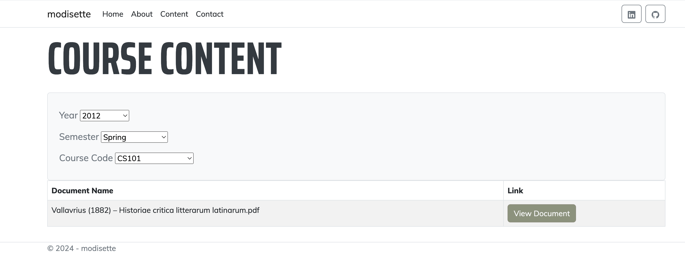
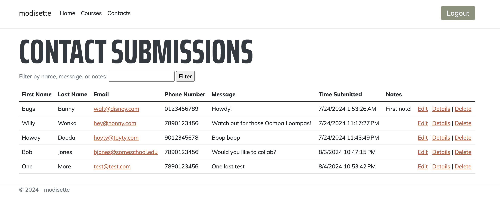
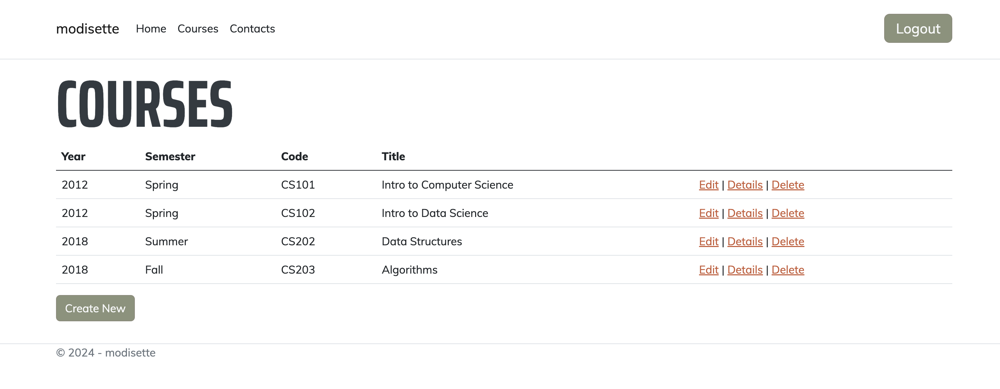
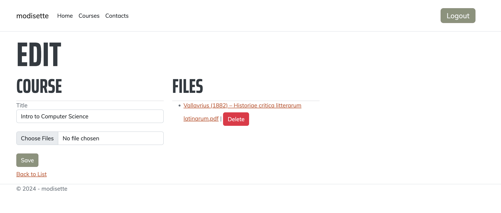

# Modisette.com

## Overview

This capstone project for CODE: You is a personal website for a client that features responsive web design and solid backend functionality. Built with ASP.NET Core Razor Pages on .NET 8, it uses C#, HTML, CSS, and JavaScript to serve public Home, About, Content, and Contact pages. The About page consumes Twitter's oEmbed API, contact form submissions are stored in SQLite, and email notifications are sent through SMTP. The admin area uses ASP.NET Core cookie authentication with configuration-backed credentials, and course files are stored locally under `wwwroot/Uploads` for now.

This project demonstrates my ability to develop viable solutions for clients by creating cohesive full-stack applications with secure authentication and authorization flows.

The app now supports SQLite for local development and PostgreSQL for deployment. Provider selection is configuration-driven, so the same code path can run locally on SQLite and in production on Supabase Postgres.

## Table of Contents

- [Demo](#demo)
- [Features](#features)
- [Technologies Used](#technologies-used)
- [Setup Instructions](#setup-instructions)
- [Dependencies](#dependencies)
- [Contact](#contact)

## Demo








## Features

  | Feature        | Description                           |
  |----------------|---------------------------------------|
  | Unit Tests | The project includes 7 unit tests which cover all the basic functions of the site. |
  | Asynchronous Methods | All of the main methods used in the program are asynchronous, ensuring a better user experience. |
  | Responsive Design | All pages are built with a responsive design in mind and will work on mobile and desktop devices. |
  | Entity Framework Core | The data layer is abstracted with EF Core as an ORM. There is a one-to-many relationship between courses and course documents, and there is a composite primary key in the courses table. |
  | Complex Queries | The content page has a series of selections which pull data from two related tables in the database. |
  | SOLID Principles | The project follows SOLID design principles where appropriate, as documented in comments within the code base. |
  | CRUD Operations | The admin section of the site allows the client to create, read, upload, and delete content, courses, and contacts as needed. |

## Technologies Used

- ASP.NET Core (Razor Pages)
- C#
- HTML/CSS (Bootstrap)
- JavaScript
- Entity Framework Core
- ASP.NET Core Cookie Authentication
- Google SMTP
- PostgreSQL / Supabase-ready provider support
- SQLite

## Setup Instructions

1. Clone the repository:
    ```sh
    git clone https://github.com/rmodis1/modisette
    ```
2. Navigate to the project directory:
    ```sh
    cd modisette
    ```
3. Restore dependencies:
    ```sh
    dotnet restore
    ```
4. Configure local secrets:
    ```sh
    dotnet user-secrets init
    dotnet user-secrets set "AdminAuth:Username" "admin"
    dotnet user-secrets set "AdminAuth:Password" "change-this-before-sharing"
    dotnet user-secrets set "Database:Provider" "sqlite"
    dotnet user-secrets set "EmailConfiguration:From" "your-smtp-address@example.com"
    dotnet user-secrets set "EmailConfiguration:SmtpServer" "smtp.gmail.com"
    dotnet user-secrets set "EmailConfiguration:SmtpPort" "587"
    dotnet user-secrets set "EmailConfiguration:SecureSocketOptions" "StartTls"
    dotnet user-secrets set "EmailConfiguration:SmtpUsername" "your-smtp-address@example.com"
    dotnet user-secrets set "EmailConfiguration:SmtpPassword" "your-app-password"
    dotnet user-secrets set "SiteEmailAddress:Name" "Site Owner"
    dotnet user-secrets set "SiteEmailAddress:Address" "owner@example.com"
    ```
    The app now validates these settings at startup. If they are missing or malformed, startup will fail instead of falling back to checked-in placeholders.

    For cloud deployments, prefer port `587` with `EmailConfiguration:SecureSocketOptions=StartTls`. Port `465` with implicit TLS can time out in some hosted environments.
5. Set up the database:
    ```sh
    dotnet ef database update
    ```
6. Run the application:
    ```sh
    dotnet run
    ```

### Admin Password Hash Option

For production, prefer a hashed admin password instead of storing plaintext in configuration. The app accepts a PBKDF2 value in the format `PBKDF2$iterations$salt$hash` via `AdminAuth:PasswordHash`. If `PasswordHash` is supplied, it is used instead of `AdminAuth:Password`.

### PostgreSQL Configuration

For Render or any other deployed environment, set these values:

```sh
Database__Provider=postgres
ConnectionStrings__Postgres=Host=...;Port=5432;Database=...;Username=...;Password=...;SSL Mode=Require;Trust Server Certificate=true
```

Local development can continue using SQLite with:

```sh
Database__Provider=sqlite
ConnectionStrings__SiteContext=Data Source=Modisette.db
```

The current checked-in EF migrations were created against SQLite. The cutover plan for creating a PostgreSQL baseline and moving data is documented in [docs/postgres-migration.md](docs/postgres-migration.md).

### Data Protection Keys In Production

ASP.NET Core uses data-protection keys to encrypt antiforgery tokens and auth cookies. In a container deployment, those keys are lost on redeploy unless you persist them outside the container filesystem.

For Render, mount a persistent disk and set:

```sh
DataProtection__KeysDirectory=/var/data/modisette-keys
```

Use the actual mount path you configured in Render if it differs. Without persistent keys, users may see one-time antiforgery or login-cookie failures after a deploy because old cookies can no longer be decrypted.

## Quality Checks

Run the full validation path locally before pushing changes:

```sh
dotnet build --configuration Release
dotnet test modisette.sln --configuration Release
```

## Dependencies

The project targets .NET 8.0, and that version of .NET will need to be installed for the site to load properly. 

## Contact

For any inquiries, please contact me at [modisetteryan.com](mailto:modisetteryan@gmail.com).
